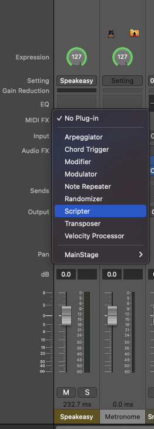
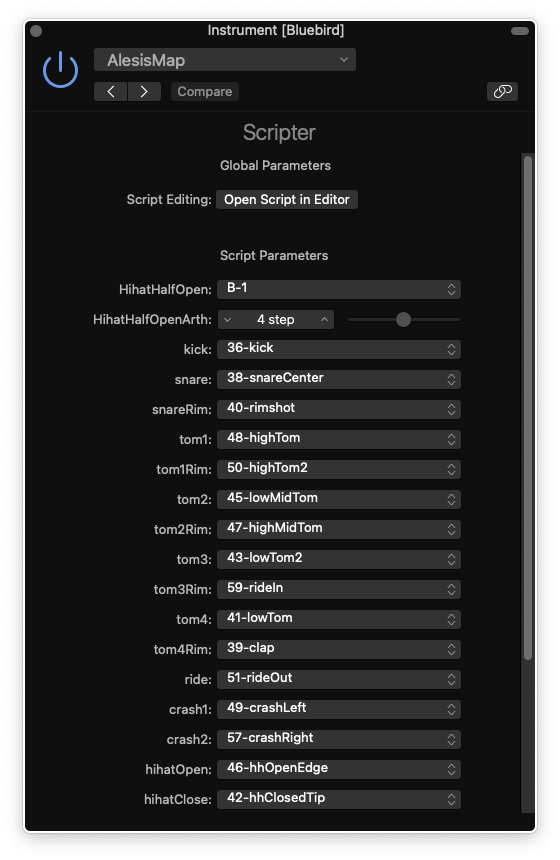
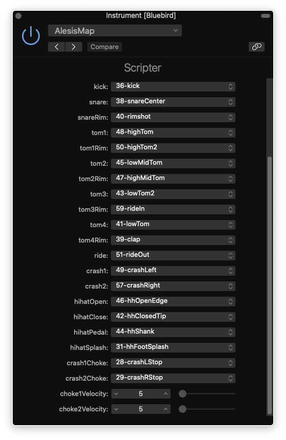

# AlesisToLogic
Logic X Midi remapper for Alesis Nitro Mesh Drum Kit 

## What it does ?

Alesis Nitro mesh kit works fine with Logic drum kits. But three function is limitted.

1. Half Open Hihat does not work
2. Hihat Splash does not work. 
3. Cymbal Choke do 

This Logic Script is fixing these three issue. Also adding mapping feature for alesis drumkit.

## To-Do:

Testing Crash2 and Tom4
Testing Rim for Tom1 Tom2 Tom3

## How to install
### Method 1 
Add the script "AlesisMapper.pst" into Logic script directory. `~/Audio\ Music\ Apps/Plug-In\ Settings/Scripter`

### Method 2
Just copy and paste the script text into new script file from Logic script editor.

In your drum mixer. Press `MIDI FX` slot and choose `Scripter`

New Scripter window will open, and paste the script over there. 

Do not forget to save script for future use. You can try it without saving.

## Usage

Hit `Run Script` button in Logic Script editor.

A gui will open, for managing channels in features in the script.

You can change  values in the script gui. 
Every time you change drum kit, `Midi FX` channel flush itself. You have to choose scripter for each drum kit after load.

## Tricks
 You can save the script as default for adding it into different drum set.
 You can save the drum kit as preset. This is usefull, you dont have to choose script every time you change drum kit.

