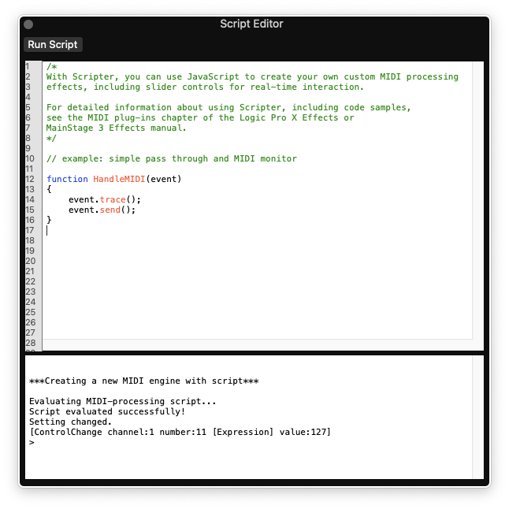

# AlesisToLogic
Logic X Midi remapper for Alesis Nitro Mesh Drum Kit 
This script can also be used in Apple - Main Stage

## What it does ?

Alesis Nitro mesh kit works fine with Logic drum kits. But three function is limitted.

1. Half Open Hihat does not work
2. Hihat Splash does not work. 
3. Cymbal Choke do 

This Logic Script is fixing these three issue. Also adding mapping feature for alesis drumkit.

## To-Do:

Testing Crash2, Crash2 Choke and Tom4.
Testing Rim for Tom1 Tom2 Tom3
They should work fine but I dont have tools for testing.

## How to Install
### Method 1 
Add the script "alesisMapper.pst" into Logic script directory: `~/Audio\ Music\ Apps/Plug-In\ Settings/Scripter`

### Method 2
Just copy and paste the script text into new script file from Logic script editor. 

To open script editor: 
In your drum mixer chanel, Press `MIDI FX` slot and choose `Scripter`

New empty Scripter window will open. Paste the script file into there. Be sure paste all content. 

Do not forget to save script for future use.

## How to Use

Hit `Run Script` button in Logic Script editor. 
If you are using default alesis mapping everything should work fine.

A gui window will open, for managing channels in features in the script.

You can change and adjust values in the script gui. 
Every time you change drum kit, `Midi FX` channel flush itself. You have to choose scripter for each drum kit after load.

### Special Features

#### HihatHalfOpenArth

Use this for adjusting half open ratio. In Logic there is total seven values. 
one is fully closed
seve is fully open
Default value for script is 4.

#### Choke

Choke signal is send with same channel with crash. But we can seperate this signal and use it producing different sound also. You can choose different sound with `crash1Choke`. Also you can adjust the velocity with `choke1Velocity`  

## Tricks
 
 * You can save the script as default for adding it into different drum set.
 * You can save the drum kit as preset. This is usefull, you dont have to choose script every time you change drum kit.
 * If you change some midi mapping in your drum module for some reason, you have to sync it with  `ALESIS_MAPPINGS` array in script editor to make this script work for you.
